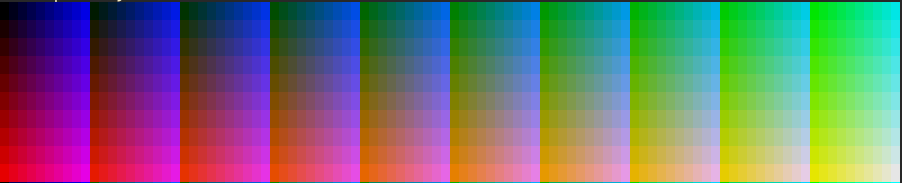

# Sily libraries for D programming language.

[sily](https://github.com/al1-ce/sily-dlang)
[sily-terminal](https://github.com/al1-ce/sily-terminal)
[sily-web](https://github.com/al1-ce/sily-web)
[sily-sdl](https://github.com/al1-ce/sily-sdl)

### This is V4 library. It will sync dependencies between sister libraries

### Right after V4 will be released V5 
### In V5 all sub-libraries will be merged into main one for my own versioning convenience

### README IS WIP (will get full *"wiki"* at some day)

## Modules

* sily - Core utils
* sily.dyaml - Improved [dyaml](https://github.com/dlang-community/D-YAML) node retrieving (DEPRECATED)
* sily.sdlang - Improved [sdlite](https://github.com/s-ludwig/sdlite) (DEPRECATED)

## core
* `sily.color` and `sily.vector`: Contains color and templated vector structs with utils
```d
// Vector can be constructed manually or with aliases
auto v1 = Vector!(int, 2)(10, 20);
auto v2 = ivec2(10, 20);
auto v3 = ivec2(10, 20);
auto v4 = vec2!int(10, 20);
// Also vector can be given only one value,
// in that case it'll be filled with that value
auto v5 = ivec4(13);
auto v6 = vec4(0.3f);
// Vector values can be accessed with array slicing,
// by using color symbols or swizzling
float v6x = v6.x;
float v6z = v6.z;
float[] v6yzx = v6.yzx;
auto rvec7 = Vector!(real, 7)(10);
auto rvec7s = rvec7.VecType(20);
col c = col(3, 4, 1, 2);
col d = c.brg;
col g = Colors.aquamarine;
vec4 v = d;
vec4 e = v.xyyz;
string code = g.toAnsiString();
```
Color can be converted to bash escape sequence to set/print colors in Ansi8, Ansi256 and TrueColor modes.



* `sily.getopt`: Contains custom getopt printer:
```d
help = getopt(
    args,
    config.bundling, config.passThrough, std.getopt.config.caseSensitive,
    "columns|c", "Sets width/columns", &conf.width,
    "rows|r", "Sets height/rows", &conf.height,
    "size|s", "Matches size. Must be \'width\', \'height\' or \'fit\'", &conf.size,

    "color|C", "Sets color type. Must be \'ansi8\', \'ansi256\', \'truecolor\'", &conf.color,
);

if (help.helpWanted || args.length == 1) {
    printGetopt(
        "Usage: app [args] file",
        "Size",
        help.options[0..3],
        "Colors",
        help.options[3],
        "Misc",
        customOption("options", "Returns options")
    );
    return 0;
}
```
Converts into:
```
Usage: app [args] image-file

Size:
  -c, --columns     Sets width/columns
  -r, --rows        Sets height/rows
  -s, --size        Matches size. Must be 'width', 'height' or 'fit'

Colors:
  -C, --color       Sets color type. Must be 'ansi8', 'ansi256', 'truecolor'

Misc:
  options           Returns options
```

* `sily.array`: Array manipulation (fill, search)
* `sily.async`: Async (timer, promise) utils
* `sily.clang`: Utils to work with C bindings (plus `sily.ptr`)
* `sily.conv`: Streamlined conversion
* `sily.curl`: JS-like http requests
* `sily.file`: File manipulation
* `sily.math`: Misc math utils
* `sily.matrix`: Matrix math
* `sily.meta.enums`: Unwraps enums
* `sily.meta.swizzle`: Swizzling used by `sily.vector` and `sily.color`. `sily.meta` itself is empty
* `sily.path`: Path manipulation
* `sily.property`: Template mixin to generate properties
* `sily.ptr`: Pointer conversion
* `sily.quat`: Quaternion math
* `sily.queue`: FCFS queue container
* `sily.random`: std.random wrapper
* `sily.stack`: LCFS stack container
* `sily.stdio`: Stdio wrapper
* `sily.string`: String manipulation
* `sily.thread`: Thread wrapper
* `sily.time`: Time wrapper
* `sily.uid`: UID generator
* `sily.uni`: `std.uni` alternative
* `sily.uri`: URI/URL parser

