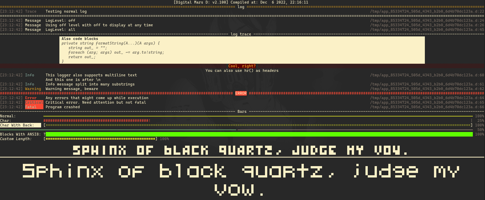
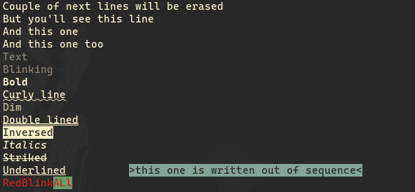

# sily-dlang [WIP]

sily lib for d

## Modules

* sily - Core utils
* sily.dlib - [DLib](https://github.com/gecko0307/dlib) utils
* sily.dyaml - Improved [dyaml](https://github.com/dlang-community/D-YAML) node retrieving
* sily.openal - WIP
* sily.opengl - [bindbc opengl](https://github.com/BindBC/bindbc-opengl) wrapper
* sily.sdl - [bindbc sdl](https://github.com/BindBC/bindbc-sdl) wrapper and utils
* sily.logger - Print pretty logs
* sily.tui - Terminal UI made easy

## Logger

### sily.logger:
* `log`: Prints nice message using full terminal width. Can be set to display Message (not affected by global log level), Trace, Info, Warning, Error, Critical and Fatal messages. Also global log level can be set which will prevent some of messages from showing
* `hr`: Prints long horizontal line and if message is set then puts text in middle of line 
* `block`: Prints code block with title
* `center`: Prints message in center of screen
* `printCompilerInfo`: Prints compiler info in form of `[Compiler: Ver] Compiled at: Date`
* `progress`: Print progress bars configured with ProgressBar struct. Must be manually erased (possibly by using `eraseLines(NUM);` from `sily.bashfmt`)
### sily.logger.pixelfont:
Contains two pixel fonts. Not recommended for continious use.
* `print5x6`: Prints text in 5x6 pixel font using unicode characters
* `get5x6`: Gets text in 5x6 font as string
* `print3x4`: Prints text in 3x4 pixel font using unicode characters
* `get3x4`: Gets text in 3x4 font as string

## Core lib
* `sily.bashfmt`: Contains almost all vt200/xterm bash formatting/cursor/screen sequences
* `sily.terminal`: Uils to get info about terminal or manipulate iostream



* `sily.color` and `sily.vector`: Contains color and templated vector structs with utils
```d
// Vector can be constructed manually or with aliases
auto v1 = Vector!(int, 2)(10, 20);
auto v2 = ivec2(10, 20);
auto v3 = Vector2i(10, 20);
auto v4 = Vector2!int(10, 20);
// Also vector can be given only one value,
// in that case it'll be filled with that value
auto v5 = ivec4(13);
auto v6 = vec4(0.3f);
// Vector values can be accessed with array slicing,
// by using color symbols or swizzling
float v6x = v6.x;
float v6z = v6.z;
float[] v6yzx = v6.yzx;
auto rvec7 = Vector!(real, 7)(10);
auto rvec7s = rvec7.VecType(20);
col c = col(3, 4, 1, 2);
col d = c.brg;
col g = Colors.aquamarine;
vec4 v = d;
vec4 e = v.xyyz;
string code = g.toAnsiString();
```
Color can be converted to bash escape sequence to set/print colors in Ansi8, Ansi256 and TrueColor modes.


* `sily.getopt`: Contains custom getopt printer:
```d
help = getopt(
    args,
    config.bundling, config.passThrough, std.getopt.config.caseSensitive,
    "columns|c", "Sets width/columns", &conf.width,
    "rows|r", "Sets height/rows", &conf.height,
    "size|s", "Matches size. Must be \'width\', \'height\' or \'fit\'", &conf.size,

    "color|C", "Sets color type. Must be \'ansi8\', \'ansi256\', \'truecolor\'", &conf.color,
);

uint _opt = 0;
if (help.helpWanted || args.length == 1) {
    printGetopt(
        "Usage: app [args] file",
        "Size",
        help.options[0..3],
        "Colors",
        help.options[3],
        "Misc",
        customOption("options", "Returns options")
    );
    return 0;
}
```
Converts into:
```
Usage: app [args] image-file

Size:
  -c, --columns     Sets width/columns
  -r, --rows        Sets height/rows
  -s, --size        Matches size. Must be 'width', 'height' or 'fit'

Colors:
  -C, --color       Sets color type. Must be 'ansi8', 'ansi256', 'truecolor'

Misc:
  options           Returns options
```
* `sily.property`: Template mixin to generate properties
* `sily.meta.swizzle`: Swizzling used by `sily.vector` and `sily.color`. `sily.meta` itself is empty
* `sily.math`: Misc math utils
* `sily.path`: Path manipulation
* `sily.file`: File manipulation
* `sily.ptr`: Pointer conversion
* `sily.clang`: Utils to work with C bindings (plus `sily.ptr`)
* `sily.array`: Array manipulation (fill, search)
* `sily.conv`: Streamlined conversion
* `sily.stdio`: Stdio wrapper
* `sily.string`: String manipulation
* `sily.time`: Time wrapper
* `sily.uni`: `std.uni` alternative

## TUI
WIP